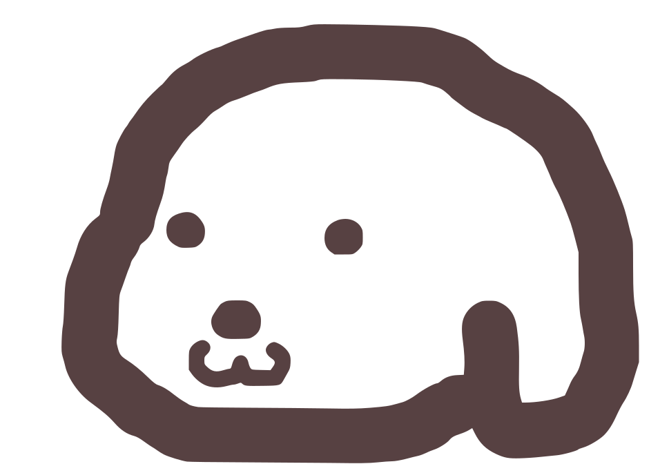

# 미니쥬(Mini-Zoo) 

> 귀여운 토스페이스 동물 이모지들이 등장하는 웹 기반 미니게임 모음입니다.
>
> [미니쥬 게임하러 가기](https://mini-zoo.vercel.app/) > <br/>

## 😎 미니게임 종류

### 1. 순서 기억하기 게임

> 화면에 나타나는 동물들의 순서를 기억하고 맞추는 방식의 게임입니다.

#### 게임 화면 스크린 샷 및 동영상

|                                                             메인 화면                                                              |                                                                     인트로 화면                                                                      |                                                                     튜토리얼 화면                                                                      |                                                                   게임 시작 화면                                                                   |                                                             게임 결과 화면                                                              |                                                            게임 준비 중 화면                                                             |
| :--------------------------------------------------------------------------------------------------------------------------------: | :--------------------------------------------------------------------------------------------------------------------------------------------------: | :----------------------------------------------------------------------------------------------------------------------------------------------------: | :------------------------------------------------------------------------------------------------------------------------------------------------: | :-------------------------------------------------------------------------------------------------------------------------------------: | :--------------------------------------------------------------------------------------------------------------------------------------: |
|  |  |  |  |  |  |

**게임 플레이 영상**

https://github.com/user-attachments/assets/d562ea52-8302-486c-9c99-cdfbda98ba7e

</div>
</details>

<br/>

### 2. 🤫 Comming Soon!

> 다음 게임을 준비 중이에요

<br />

---

## 🧐 주요 기능

- **단계별 난이도 상승**: 레벨이 올라갈수록 속도가 빨라지거나 여러 동물들이 나타나면서 난이도가 올라갑니다.
- **재미있는 애니메이션**: Motion 라이브러리를 활용하여 동물들이 나타날 때나 사용자 이벤트가 있을 때 동적인 애니메이션 효과를 구현했습니다.
- **최고 점수 기록**: 사용자의 최고 점수를 브라우저(LocalStorage)에 저장하여 메인 화면에서 각 게임별 최고 기록을 확인 할 수 있습니다.
- **튜토리얼 제공**: 게임을 처음 접하는 사용자를 위해 간단한 튜토리얼을 제공합니다. 한 번이라도 플레이하여 점수가 기록된 게임은 튜토리얼을 생략합니다.

## 🤯 기술 스택

- **Framework**: Next.js 15
- **Language**: TypeScript 5
- **Library**: React 19
- **Animation**: Motion (`motion`)
- **Utilities**: `ts-pattern` (패턴 매칭), `es-toolkit` (유틸리티 함수)
- **Code Quality**: ESLint (코드 린팅), Knip (미사용 코드 탐지)

## 😶‍🌫️ 프로젝트 구조

```
mini-zoo/
├── public/              # 이미지, 파비콘 등 정적 에셋
├── src/
│   ├── components/      # 공통 재사용 컴포넌트 (Button, Icon, Layout 등)
│   ├── constants/       # 공통 상수 (색상, 레이아웃 값 등)
│   ├── hooks/           # 커스텀 훅
│   ├── pages/           # 페이지 컴포넌트
│   │   ├── home/        # 메인 페이지
│   │   └── sequence-memory-game/ # 순서 기억하기 게임
│   │       ├── common/    # 게임 공통 요소
│   │       ├── intro/     # 게임 인트로 페이지
│   │       ├── playing/   # 게임 플레이 페이지
│   │       └── tutorial/  # 튜토리얼 게임 페이지
│   ├── query-options/   # 쿼리 옵션(TanStack)
│   └── utils/           # 유틸리티 함수
└── package.json         # 프로젝트 설정 및 의존성 관리
```

## 🤗 시작하기

1.  **저장소 복제:**

    ```bash
    git clone https://github.com/230-Luna/mini-zoo.git
    cd mini-zoo
    ```

2.  **의존성 설치:**

    ```bash
    npm install
    ```

3.  **개발 서버 실행:**
    ```bash
    npm run dev
    ```
    브라우저에서 `http://localhost:3000`으로 접속하세요.
